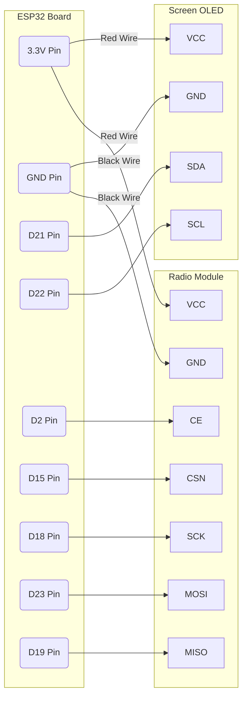

# SkySweep32 Build from Scratch (Beginner's Guide)

If you've never built electronics before, don't know how to solder, and are hearing the word "microcontroller" for the first time — **this guide is for you**. 
Here we will assemble the basic version of the drone detector (Starter Tier) without a soldering iron, simply snapping wires together like Lego bricks.

---

## 🛒 Step 1: What do I need to buy?

You only need to buy 4 items (available at any electronics store or Amazon/AliExpress):

1. **The Brain:** `ESP32 DevKit V1` Board (Usually a black board the size of a flash drive, with a Type-C or MicroUSB port. Get the 30-pin or 38-pin version).
2. **The Ears (Radio Module):** `NRF24L01+` Module (It's best to get the black board with a screw-on antenna, look for "NRF24L01+ PA+LNA").
3. **The Face (Screen):** `0.96 inch OLED Display, I2C` (A small blue/white screen with 4 pins at the bottom).
4. **The Wires:** A bundle of `Dupont jumper wires (Female-to-Female)` (Wires with holes on both ends to slip over the pins).

---

## 🔌 Step 2: The Easiest Wiring Guide Ever

Don't be intimidated by the pin names. Just take a wire, slip one end onto the pin on the ESP32 board, and the other end onto the pin of the screen or radio module.

### Connecting the Screen (OLED)
The screen only has 4 legs:
| Pin on Screen | Where to plug on ESP32 | What it does |
|---|---|---|
| **VCC** (Power) | **3V3** (or 3.3V) | Provides electricity |
| **GND** (Ground) | **GND** | The negative power pole |
| **SDA** (Data) | **D21** (or GPIO 21) | The pipe where pictures flow |
| **SCL** (Clock) | **D22** (or GPIO 22) | The rhythm for the pictures |

### Connecting the Radio Module (NRF24L01+)
The module has 8 pins (two rows of 4). Connect them like this:
| Pin on NRF24 | Where to plug on ESP32 |
|---|---|
| **VCC** (Power) | **3V3** (WARNING: NEVER plug this into 5V, the module will burn!) |
| **GND** (Ground) | **GND** |
| **CE** | **D2** (or GPIO 2) |
| **CSN** | **D15** (or GPIO 15) |
| **SCK** | **D18** (or GPIO 18) |
| **MOSI** | **D23** (or GPIO 23) |
| **MISO** | **D19** (or GPIO 19) |

*(Leave the 8th pin 'IRQ' disconnected, it just hangs in the air).*

---

## 🗺️ Visual Diagram (Mermaid)

> This is a block diagram of the connections to help you visualize. The lines are your physical wires.

---

## 💻 Step 3: How to "Flash" the brain

You have the hardware assembled, but it's empty. You need to pour the program into it. Previously you needed complicated programmer software, but now it's just 1 click!

1. Plug a USB cable into your computer, and the other end into the ESP32 board.
2. Download the folder with this project to your computer.
3. Find the file inside called **`flash.bat`** (or just `flash`, it might have a gear icon).
4. Double-click it to run it. 
5. A black window will appear and automatically find your board. Press the number **1** (for Starter Tier) and hit Enter.
6. You will see percentages scrolling by for about 1 minute. **You are done!** The text "SkySweep32" should light up on the screen of your device.

*(If `flash.bat` didn't work: open the Chrome browser, go to [esptool-js](https://espressif.github.io/esptool-js/), set `Baudrate: 460800`, click Connect, select the `SkySweep32_Starter_v0.4.0.bin` file from the `releases` folder, and click Program).*

## 📱 Step 4: How to use the Radar (Web Dashboard)

1. As soon as you flash the board, it will create a new Wi-Fi network.
2. Take your phone, go to Wi-Fi settings, and look for the network called **SkySweep32_AP**.
3. Password: `skysweep`
4. Open any browser (Chrome, Safari, Edge) and enter this address: `http://192.168.4.1`
5. **Congratulations!** You are looking at the control panel. If a drone with a controller flies nearby, the phone screen will immediately light up with a warning!
